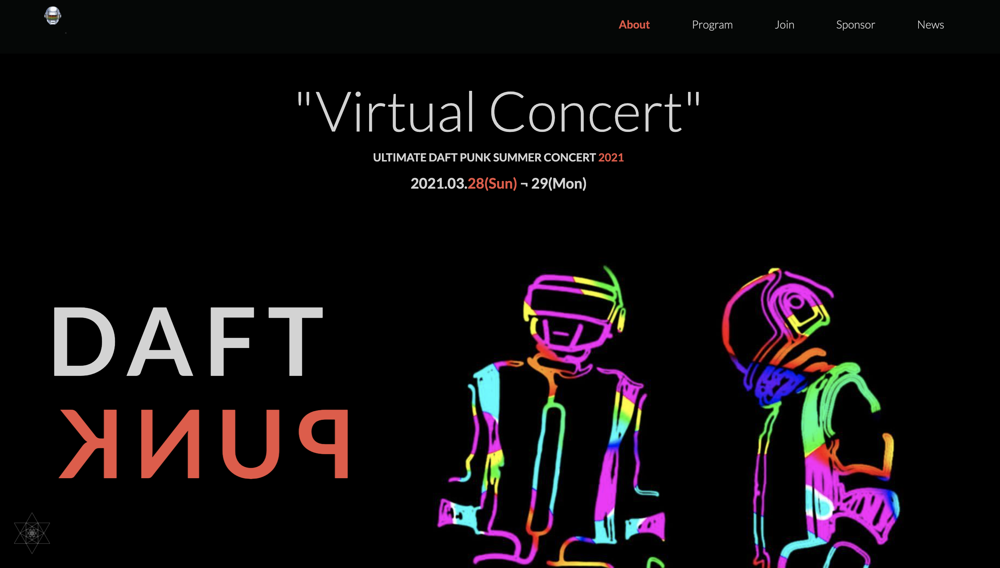
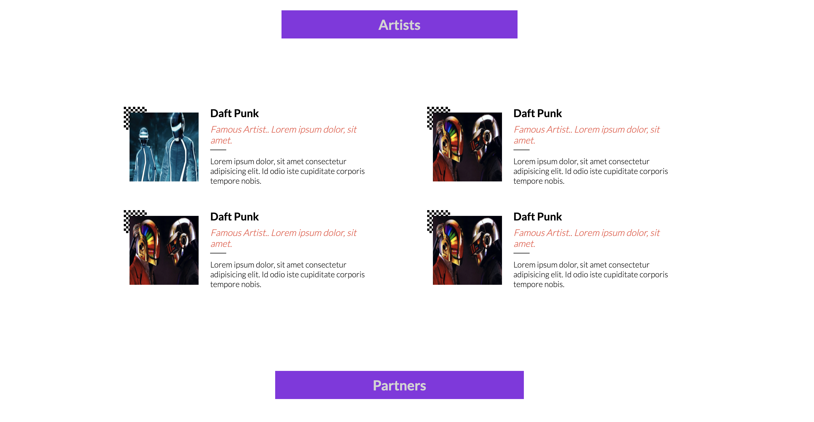
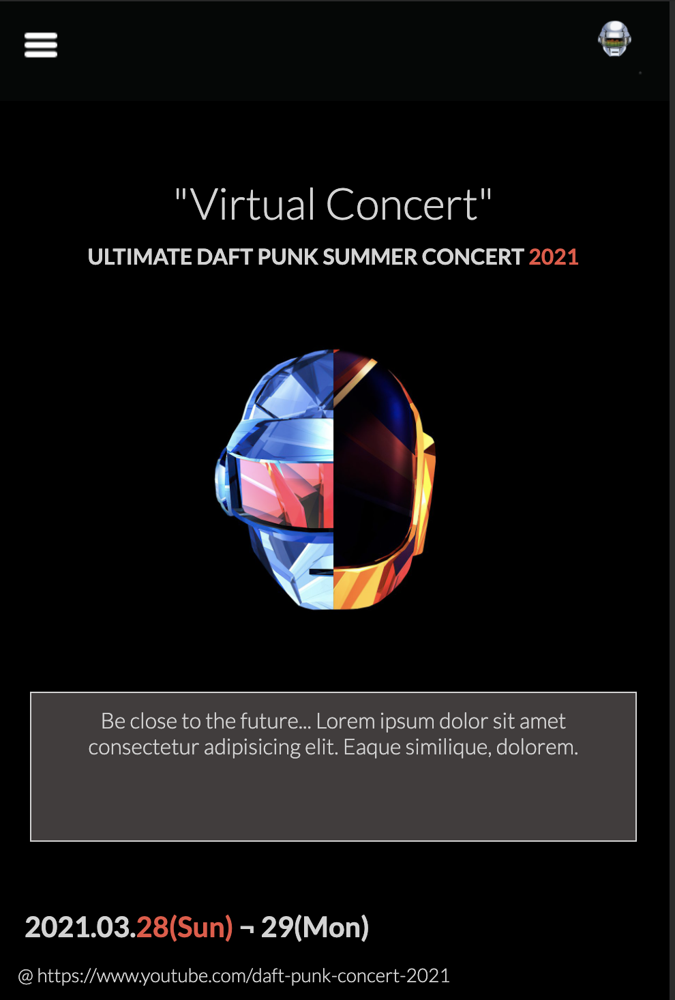
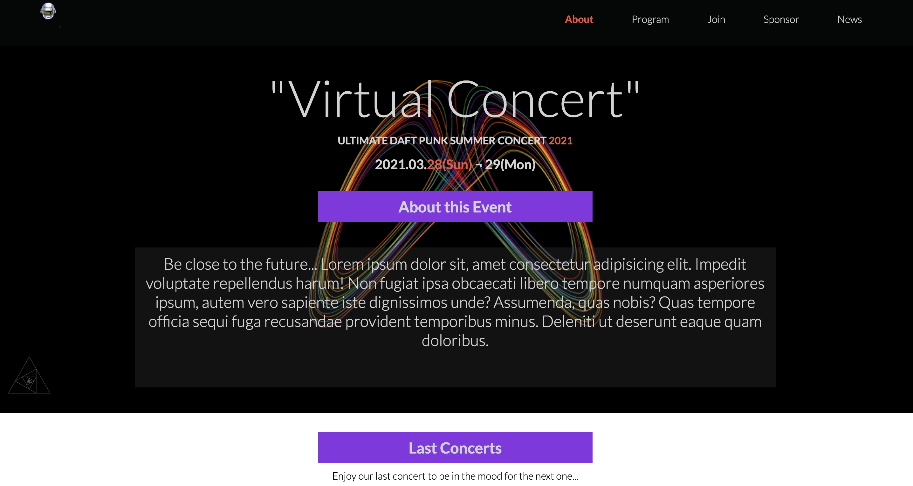

# capstone_project aka DAFT PUNK SUMMER VIRTUAL CONCERT

## Goal

In this project, I worked on creating a responsive website for a special event which is a virtual concert of the famous team singers DAFT PUNK. For thiis project, I worked on three pages for three days, to show up the concept before moving forward. 
The original project is based on an online website for a conference.

You can view the original project on : 
https://www.behance.net/gallery/29845175/CC-Global-Summit-2015

## Color Palette

Base : #272A31, #EC5242, #D3D3D3
ADDED : yellow, #000, Violet

Display each element accordingly by respecting the palette color and the typography.

For this first approach, I used:
- Flexbox,
- Grid,
- Float positioning 

## Screenshots

- Major languages: HTML5, CSS3
- Frameworks: Bootstrap, Github flow, Mobile First Approach
- Technologies used: Responsive Web Design

>## Live Demo
[Live Demo Link](https://anvi98.github.io/capstone_project/)
[Presentation video Link](https://www.loom.com/share/4dc296b96c524a759c1be1394af8fd8c)
>## Getting started

- npm install bootstrap

### Prerequisites

- Create an account on github

- Install gitbash or use git on the command line.

- Use an IDE of your preference such as VScode.
  
- Linter tests

### Steps to follow

- Clone the repository to your locaL machine.

- Open the index.html file with the browser of your preference.

>## Acknowledgments

- Hat tip to anyone whose code was used
- Inspiration
- Learning

>## 📝 License

This project is [MIT](./LICENSE) licensed.

>## Authors
 👤 **Alex Anvi Eponon**
- GitHub: [@Anvi98](https://github.com/Anvi98)
- Twitter: [@anvi_al](https://twitter.com/anvi_al)
- LinkedIn: [LinkedIn](https://www.linkedin.com/in/anvi-alex-eponon/)

